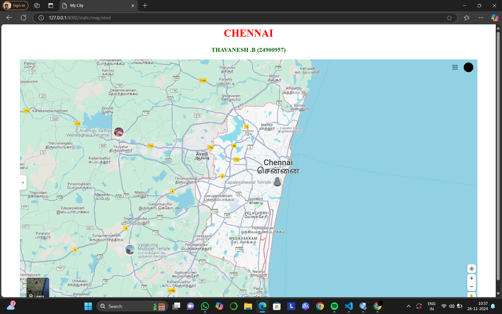
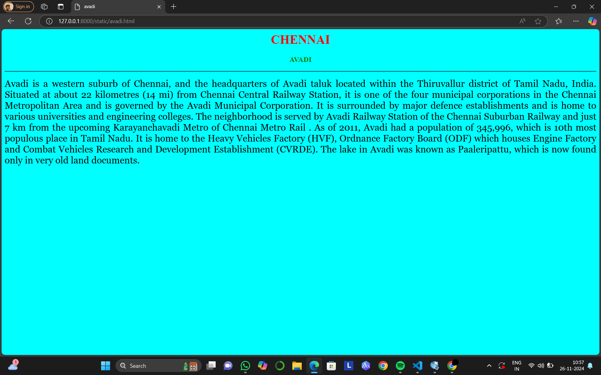
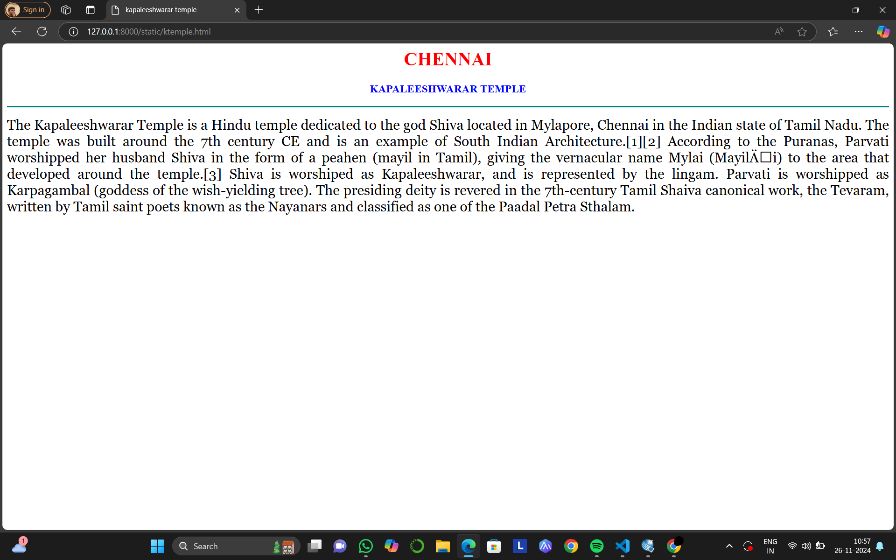
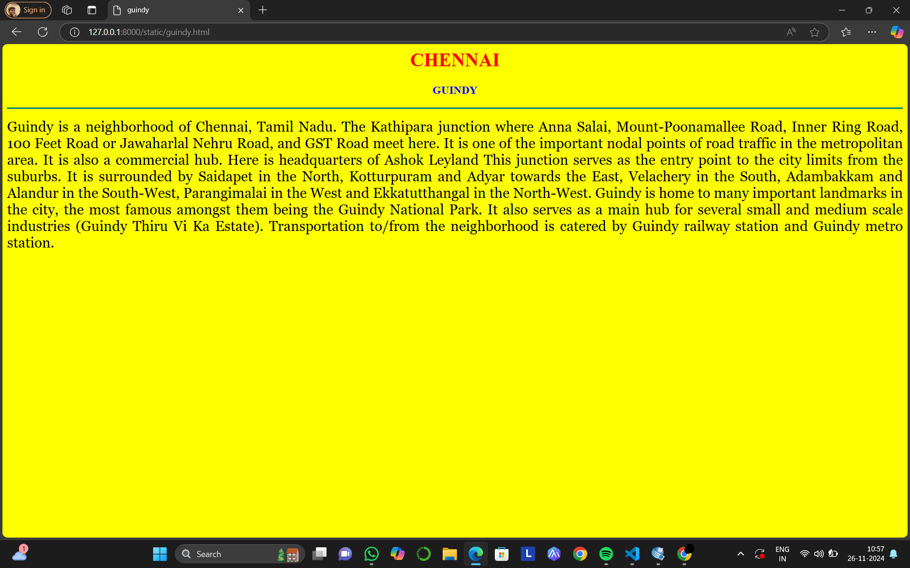
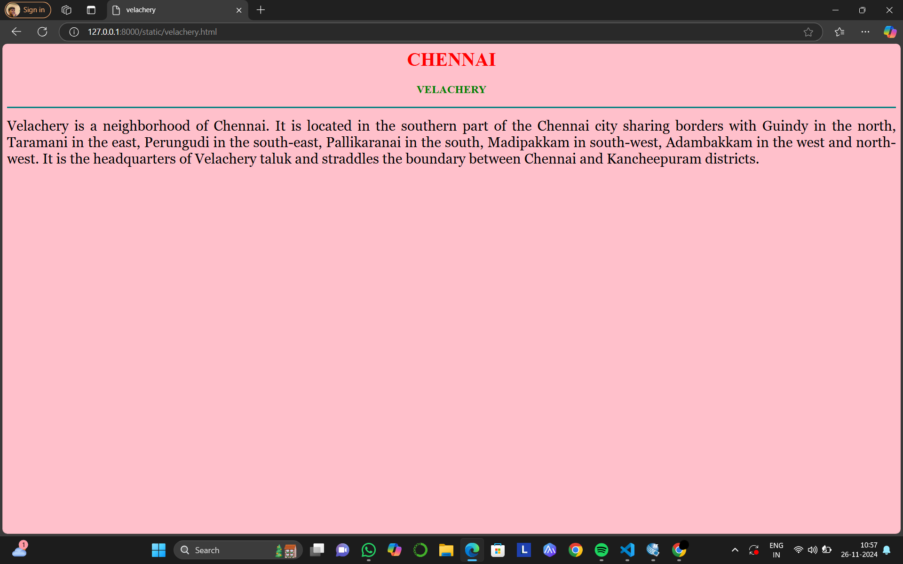
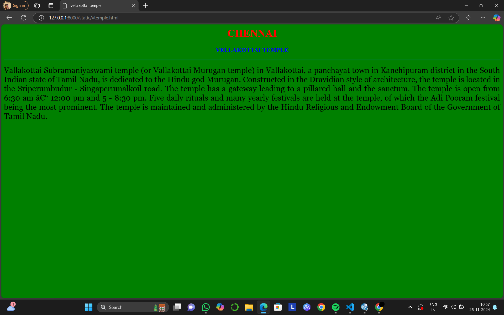

# Ex04 Places Around Me
## Date: 26/11/2024

## AIM
To develop a website to display details about the places around my house.

## DESIGN STEPS

### STEP 1
Create a Django admin interface.

### STEP 2
Download your city map from Google.

### STEP 3
Using ```<map>``` tag name the map.

### STEP 4
Create clickable regions in the image using ```<area>``` tag.

### STEP 5
Write HTML programs for all the regions identified.

### STEP 6
Execute the programs and publish them.

## CODE
```
map.html

<html>
    <head>
        <title>
            My City
        </title>
    </head>
    <body>
        <h1 align="center">
            <font color="red"><b>CHENNAI</b></font>
        </h1>
        <h3 align="center">
            <font color="darkgreen"><b>THAVANESH .B (24900957)</b></font>
        </h3>
        <center>
            

<map name="MY CITY">

    <area target="" alt="AVADI" title="AVADI" href="avadi.html" coords="531,274,589,316" shape="rect">
    <area target="" alt="VELACHERY" title="VELACHERY" href="velachery.html" coords="678,459,765,487" shape="rect">
    <area target="" alt="GUINDY" title="GUINDY" href="guindy.html" coords="692,414,754,444" shape="rect">
    <area target="" alt="KAPALEESHWARAR TEMPLE" title="KAPALEESHWARAR TEMPLE" href="ktemple.html" coords="623,364,797,390" shape="rect">
    <area target="" alt="VALLAKOTTAI MURUGAN TEMPLE" title="VALLAKOTTAI MURUGAN TEMPLE" href="vtemple.html" coords="325,553,469,615" shape="rect">

</map>
        </center>   
       
        
    </body>
</html>

velachery.html

<html>
    <head>
        <title>
            velachery
        </title>
    </head>
    <body bgcolor="pink">
        <h1 align="center">
            <font color="red"><b>CHENNAI</b></font></h1>
        <h3 align="center">
            <font color="green"><b>VELACHERY</b></font>
        </h3>
       <hr size="3" color="teal">
       <p align="justify" >
        <font face="Georgia" size="5">
            Velachery is a neighborhood of Chennai. It is located in the southern part of the Chennai city sharing borders with Guindy in the north, Taramani in the east, Perungudi in the south-east, Pallikaranai in the south, Madipakkam in south-west, Adambakkam in the west and north-west. It is the headquarters of Velachery taluk and straddles the boundary between Chennai and Kancheepuram districts.
        </font>
       </p>
    </body>
</html>

avadi.html

<html>
    <head>
        <title>
            avadi
        </title>
    </head>
    <body bgcolor="cyan">
        <h1 align="center">
            <font color="red"><b>CHENNAI</b></font></h1>
        <h3 align="center">

        <font color="green"><b>AVADI</b></font>
        </h3>
       <hr size="3" color="teal">
       <p align="justify" >
        <font face="Georgia" size="5">
            Avadi is a western suburb of Chennai, and the headquarters of Avadi taluk located within the Thiruvallur district of Tamil Nadu, India. Situated at about 22 kilometres (14 mi) from Chennai Central Railway Station, it is one of the four municipal corporations in the Chennai Metropolitan Area and is governed by the Avadi Municipal Corporation. It is surrounded by major defence establishments and is home to various universities and engineering colleges. The neighborhood is served by Avadi Railway Station of the Chennai Suburban Railway and just 7 km from the upcoming Karayanchavadi Metro of Chennai Metro Rail . As of 2011, Avadi had a population of 345,996, which is 10th most populous place in Tamil Nadu. It is home to the Heavy Vehicles Factory (HVF), Ordnance Factory Board (ODF) which houses Engine Factory and Combat Vehicles Research and Development Establishment (CVRDE). The lake in Avadi was known as Paaleripattu, which is now found only in very old land documents.
        </font>
       </p>
    </body>
</html>

guindy.html

<html>
    <head>
        <title>
            guindy
        </title>
    </head>
    <body bgcolor="yellow">
        <h1 align="center">
            <font color="red"><b>CHENNAI</b></font></h1>
        <h3 align="center">
            <font color="blue"><b>GUINDY</b></font>
        </h3>
       <hr size="3" color="teal">
       <p align="justify" >
        <font face="Georgia" size="5">
            Guindy is a neighborhood of Chennai, Tamil Nadu. The Kathipara junction where Anna Salai, Mount-Poonamallee Road, Inner Ring Road, 100 Feet Road or Jawaharlal Nehru Road, and GST Road meet here. It is one of the important nodal points of road traffic in the metropolitan area. It is also a commercial hub. Here is headquarters of Ashok Leyland This junction serves as the entry point to the city limits from the suburbs. It is surrounded by Saidapet in the North, Kotturpuram and Adyar towards the East, Velachery in the South, Adambakkam and Alandur in the South-West, Parangimalai in the West and Ekkatutthangal in the North-West. Guindy is home to many important landmarks in the city, the most famous amongst them being the Guindy National Park. It also serves as a main hub for several small and medium scale industries (Guindy Thiru Vi Ka Estate). Transportation to/from the neighborhood is catered by Guindy railway station and Guindy metro station.
        </font>
       </p>
    </body>
</html>

vtemple.html

<html>
    <head>
        <title>
            vellakottai temple
        </title>
    </head>
    <body bgcolor="green">
        <h1 align="center">
            <font color="red"><b>CHENNAI</b></font></h1>
        <h3 align="center">
            <font color="blue"><b>VELLAKOTTAI TEMPLE</b></font>
        </h3>
       <hr size="3" color="teal">
       <p align="justify" >
        <font face="Georgia" size="5">
            Vallakottai Subramaniyaswami temple (or Vallakottai Murugan temple) in Vallakottai, a panchayat town in Kanchipuram district in the South Indian state of Tamil Nadu, is dedicated to the Hindu god Murugan. Constructed in the Dravidian style of architecture, the temple is located in the Sriperumbudur - Singaperumalkoil road.

The temple has a gateway leading to a pillared hall and the sanctum. The temple is open from 6:30 am – 12:00 pm and 5 - 8:30 pm. Five daily rituals and many yearly festivals are held at the temple, of which the Adi Pooram festival being the most prominent. The temple is maintained and administered by the Hindu Religious and Endowment Board of the Government of Tamil Nadu.
        </font>
       </p>
    </body>
</html>

ktemple.html

<html>
    <head>
        <title>
            kapaleeshwarar temple
        </title>
    </head>
    <body bgcolor="white">
        <h1 align="center">
            <font color="red"><b>CHENNAI</b></font></h1>
        <h3 align="center">
            <font color="blue"><b>KAPALEESHWARAR TEMPLE</b></font>
        </h3>
       <hr size="3" color="teal">
       <p align="justify" >
        <font face="Georgia" size="5">
            The Kapaleeshwarar Temple is a Hindu temple dedicated to the god Shiva located in Mylapore, Chennai in the Indian state of Tamil Nadu. The temple was built around the 7th century CE and is an example of South Indian Architecture.[1][2]

According to the Puranas, Parvati worshipped her husband Shiva in the form of a peahen (mayil in Tamil), giving the vernacular name Mylai (Mayilāi) to the area that developed around the temple.[3] Shiva is worshiped as Kapaleeshwarar, and is represented by the lingam. Parvati is worshipped as Karpagambal (goddess of the wish-yielding tree). The presiding deity is revered in the 7th-century Tamil Shaiva canonical work, the Tevaram, written by Tamil saint poets known as the Nayanars and classified as one of the Paadal Petra Sthalam.
        </font>
       </p>
    </body>
</html>


```


## OUTPUT








## RESULT
The program for implementing image maps using HTML is executed successfully.
